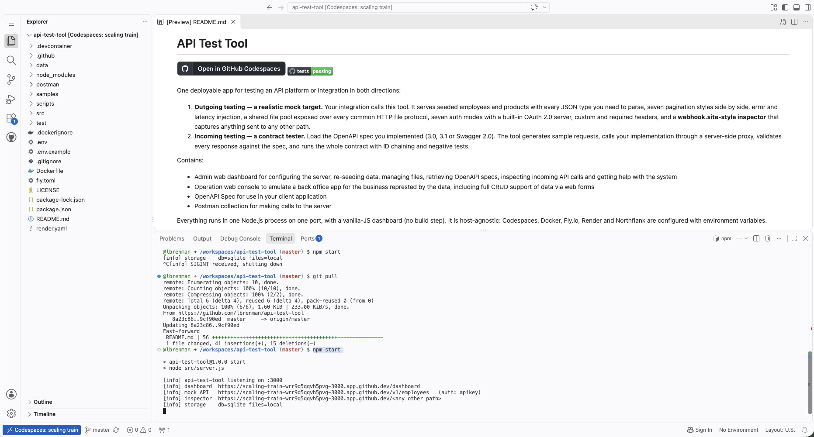
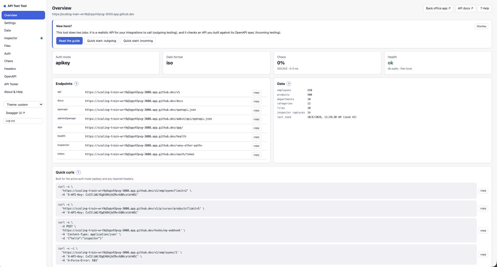

# API Test Tool

[](https://codespaces.new/lbrenman/api-test-tool)
[](https://github.com/lbrenman/api-test-tool/actions/workflows/newman.yml)

One deployable app for testing an API platform or integration in both directions:

1. **Outgoing testing — a realistic mock target.** Your integration calls this tool. It serves seeded employees and products with every JSON type you need to parse, seven pagination styles side by side, error and latency injection, a shared file pool exposed over every common HTTP file protocol, seven auth modes with a built-in OAuth 2.0 server, custom and required headers, and a **webhook.site-style inspector** that captures anything sent to any other path.
2. **Incoming testing — a contract tester.** Load the OpenAPI spec you implemented (3.0, 3.1 or Swagger 2.0). The tool generates sample requests, calls your implementation through a server-side proxy, validates every response against the spec, and runs the whole contract with ID chaining and negative tests.

Contains:

* Admin web dashboard for configuring the server, re-seeding data, managing files, retrieving OpenAPI specs, inspecting incoming API calls and getting help with the system
* Operation web console to emulate a back office app for the business represted by the data, including full CRUD support of data via web forms
* OpenAPI Spec for use in your client application
* Postman collection for making calls to the server
* Employee and Product data exposed via configurable APIs to test authentication, pagination, errors, webhooks, file access

Everything runs in one Node.js process on one port, with a vanilla-JS dashboard (no build step). It is host-agnostic: Codespaces, Docker, Fly.io, Render and Northflank are configured with environment variables.

Ues Cases:

* You need a reliable data source for an api demo
* You need to secure your API with OAuth2 and need an external OAuth2 server
* You are trying to learn how to implement some API feature such as pagination or header introspection
* You need an http file upload/download endpoint for a file based flow
* You need an S3 bucket to test an S3 connector, without an AWS account
* You need to experiment with advanced orchestration/aggregation functions such as data aggregation/join/deduplication and you need a data source
* You are debugging an http client call and need a web catcher to see what your platform is actually sending





---

## Contents

- [API Test Tool](#api-test-tool)
  - [Contents](#contents)
  - [Quick start](#quick-start)
    - [GitHub Codespaces (fastest)](#github-codespaces-fastest)
    - [Local](#local)
    - [Docker](#docker)
  - [Features](#features)
  - [Configuration](#configuration)
  - [Route map](#route-map)
  - [Authentication](#authentication)
  - [Mock API conventions](#mock-api-conventions)
  - [Pagination](#pagination)
  - [Chaos: errors and latency](#chaos-errors-and-latency)
  - [Files](#files)
  - [SOAP services](#soap-services)
  - [WebSocket channels](#websocket-channels)
  - [Server-Sent Events](#server-sent-events)
  - [OData v4](#odata-v4)
  - [GraphQL](#graphql)
  - [S3-compatible API](#s3-compatible-api)
  - [Inspector](#inspector)
  - [Outgoing webhooks](#outgoing-webhooks)
  - [API tester walkthrough](#api-tester-walkthrough)
    - [SOAP services (WSDL)](#soap-services-wsdl)
    - [WebSocket APIs (AsyncAPI or a scenario)](#websocket-apis-asyncapi-or-a-scenario)
  - [Postman and Newman](#postman-and-newman)
  - [Deployment](#deployment)
    - [Fly.io](#flyio)
    - [Render](#render)
    - [Northflank](#northflank)
    - [Docker / any container host](#docker--any-container-host)
    - [Codespaces](#codespaces)
  - [Development](#development)
  - [Troubleshooting](#troubleshooting)
  - [License](#license)

---

## Quick start

### GitHub Codespaces (fastest)

Click the badge above. The devcontainer installs dependencies, starts the server, and makes port 3000 **public** so external systems (your API platform, webhooks, Postman) can reach it. The dashboard URL is printed in the terminal:

```
https://<codespace-name>-3000.app.github.dev/dashboard
```

Set an admin password before sharing the URL: put `ADMIN_PASSWORD=...` in `.env` (created from `.env.example` on first start) and restart with `pkill -f src/server.js; bash .devcontainer/start.sh`. Server logs are in `/tmp/api-test-tool.log`.

### Local

```bash
git clone https://github.com/lbrenman/api-test-tool && cd api-test-tool
npm install
cp .env.example .env      # optional
npm start                 # http://localhost:3000/dashboard
```

Requires Node.js 22+.

### Docker

```bash
docker build -t api-test-tool .
docker run -p 3000:3000 -v att-data:/data -e ADMIN_PASSWORD=change-me api-test-tool
```

Fly.io, Render and Northflank are covered in [Deployment](#deployment).

---

## Features

| Area | What you get |
|---|---|
| **Data** | 250 employees and 500 products (configurable) with int, float, decimal-as-string, boolean, null, enum, UUID, date-only, timestamps, string arrays, object arrays, nested and free-form objects, and unicode text (accents, emoji, quotes, CJK). Deterministic Faker seed; departments and categories keep relational integrity. |
| **CRUD conventions** | 201 + `Location`, PUT full replace, PATCH as JSON Merge Patch, 204 on delete, `ETag` / `If-Match` (412) / `If-None-Match` (304), `Idempotency-Key` replay and 409 on reuse, `X-Request-Id` / `X-Correlation-Id`, RFC 9457 `problem+json` errors, 400/422 validation with field errors. |
| **Query** | `?fields=a,b.c`, `?field=value`, `?field[gte]=…` (eq, ne, gt, gte, lt, lte, in, nin, like, exists), `?q=` text search, `?sort=-a,b`. |
| **Pagination** | offset, page, cursor, keyset, RFC 8288 `Link`, HAL, and Google-style `pageToken`, each on its own path and all available at once. |
| **Dates** | One global format for every timestamp: ISO UTC, ISO with offset, epoch seconds, epoch ms, RFC 1123, or a custom dayjs pattern. Any of them is accepted on input. |
| **Chaos** | Error rate %, error types (any 4xx/5xx, `timeout`, `reset`, `malformed-json`, `truncated-body`, `empty-body`, `wrong-content-type`, `slow-drip`), latency range, per-route overrides, and deterministic forcing headers. |
| **Rate limiting** | A real per-client limiter with `RateLimit-*` headers and 429 + `Retry-After`. |
| **Headers** | Custom headers added to every response, and required request headers (with optional expected values) enforced on `/v1/*`. |
| **Auth** | `none`, `apikey` (header or query), `basic`, `bearer`, `jwt` (HS256/RS256, JWKS), `oauth2` (scopes), `hmac` (signed requests). |
| **OAuth 2.0 server** | client_credentials, authorization_code + PKCE (login/consent page), refresh_token (rotating), introspection (RFC 7662), revocation (RFC 7009), RFC 8414 metadata, JWKS, and dynamic client registration (RFC 7591, with RFC 7592 read/delete) for MCP clients and other self-registering apps: public or confidential clients, loopback and custom-scheme redirects, open or token-protected. |
| **Files** | One shared pool (local disk or S3-compatible) behind multipart, raw, base64-in-JSON, tus resumable, presigned URLs, range downloads (206) and chunked downloads. Sample CSV, XLSX, JSON, PNG, JPG, PDF, TXT, ZIP and a 10 MB binary are generated on seed. |
| **SOAP** | Mock SOAP 1.1 and 1.2 services (`EmployeeService`, `ProductService`) over the same data, with live WSDLs (document/literal, a SOAP 1.1 and a 1.2 binding). Get, List (paging, filters, text search, sort), Create, Update, Delete. Auth mode, chaos, rate limits and required headers apply as on `/v1`; errors are SOAP faults with field-level detail. Optional WS-Security UsernameToken (PasswordText and PasswordDigest) and SOAPAction checking. |
| **WebSocket** | Mock channels over the same data: `/ws/echo`, `/ws/rpc` (JSON-RPC 2.0: get/list employees, products, departments, categories) and `/ws/changes` (live created/updated/deleted events from any protocol), with an AsyncAPI 3.0 document. The upgrade goes through auth, rate limiting, required headers and chaos. Size limit (1009), idle timeout, keep-alive pings, and a live console in the dashboard. In-house RFC 6455 implementation, no dependency. |
| **Server-Sent Events** | `/sse/changes` (live change feed from any protocol, Last-Event-ID replay, `event: reset` on gaps), `/sse/ticks` (numbered, resumable) and `POST /sse/stream` (LLM-style token streaming, plain events or OpenAI chunk format with `[DONE]`). Heartbeats, `retry:`, stream chaos (`dropAfter`, `malformedAt`, `skipIds`), documented in `/openapi.json`, with a live viewer in the dashboard. The tester reads SSE responses for a time window. |
| **OData v4** | `/odata/v4` over the same data: service document, CSDL `$metadata`, `$filter` (comparison, logical, arithmetic, `in`, string/date/math functions, `any`/`all` lambdas, navigation paths), `$select`, `$expand` with nested options, `$orderby`, `$top`, `$skip`, `$count`, `$search`, server-driven paging with `@odata.nextLink` and `Prefer: odata.maxpagesize`, key/property/`$value`/navigation addressing, and create/update/delete with `@odata.bind`, `Prefer: return=…` and If-Match ETags. OData error format, `odata.metadata=none/minimal/full`, a query console in the dashboard. |
| **S3-compatible API** | The file pool as an S3 bucket at the base URL (path-style), whether files are stored locally or in S3: ListBuckets, HeadBucket, GetBucketLocation, ListObjects v1/v2 (prefix, delimiter, paging, `encoding-type=url`), Get/Head (Range, conditional headers, `response-*` overrides), Put (aws-chunked streaming, CRC32/SHA checksums, Content-MD5), Copy, Delete, DeleteObjects, multipart uploads and presigned URLs. Real AWS Signature V4 checks against a configurable access key, secret and region; S3 XML errors; works with the AWS SDKs, the AWS CLI, curl `--aws-sigv4` and Postman's AWS Signature auth. |
| **GraphQL** | `/graphql` over the same data: queries with offset pages and Relay connections (filters, sort, search), nested department/category/manager resolvers, CRUD mutations with merge-patch updates, and a live `changes` subscription over WebSocket (graphql-transport-ws). Field errors come back as HTTP 200 with partial data and `extensions.code`; auth, rate-limit and chaos errors keep their HTTP status. GraphQL-over-HTTP media types, introspection on/off, depth limit, injected field errors (`X-Force-GraphQL-Error`), SDL at `/graphql/schema.graphql`, GraphiQL in the browser and a query console in the dashboard. |
| **Outgoing webhooks** | Any number of webhooks that POST `{event, resource, resourceId, href, …}` to your URL when an employee, product, department or category is created, updated or deleted, or a file is uploaded, downloaded or deleted, through any protocol. Per webhook: resources, events, optional record data, HMAC signing secret and extra headers. Stored in the database (they survive restarts); every delivery is logged with the response, with Test and Resend buttons. |
| **Inspector** | Catch-all capture with the actual path, live stream (SSE), detected auth (Basic user, decoded JWT, API keys), pretty bodies and multipart parts, copy as curl, replay, auto-forward, configurable responses and path rules. |
| **Generated OpenAPI** | Two OAS 3.1 specs, regenerated from the live settings. **Mock Data API** (`/openapi.json`, `/openapi.yaml`) is for integrations: `/v1` resources, every pagination path, the file endpoints, the SSE streams and the OAuth token endpoint, reflecting the server URL, date format, auth scheme, required headers and chaos headers. **Admin API** (`/admin/api/openapi.json`, `.yaml`, password protected) is for operators and scripts: settings, seeding, files, OAuth clients, inspector, tester, `/health` and `/ready`. Swagger UI at `/docs` shows both (`/docs?spec=admin` for the admin spec). |
| **API tester** | Upload, paste or URL load for OAS 3.0, 3.1 and Swagger 2.0 (REST), WSDL 1.1 (SOAP 1.1/1.2, with XSD validation and WS-Security) and AsyncAPI 2.x/3.0 (WebSocket, with message validation, correlation and scripted scenarios). Spec lint, per-operation "try it" with generated samples that honour `pattern`/`format`/`enum`/limits, auth profiles (none, API key, Basic, Bearer, OAuth2 client credentials), response validation, run-all contract mode with ID chaining and negative tests, run history, and JSON and HTML reports. "Mock from spec" serves a spec's examples from this tool. |
| **Back office app** | `/app` is a business-style app over the mock data, for demos and non-technical viewers: KPIs (headcount, payroll, stock value, stock health), charts, searchable and sortable lists, record pages with related records, and forms to create, edit and delete employees, products, departments and categories. It reads and writes the same data as `/v1` but through its own backend (`/admin/api/app/*`), so the `/v1` auth mode, chaos, rate limits and required headers never break it. Uses the dashboard password. |
| **Dashboard** | Overview, Settings (with source badges and resets), Data, Inspector, Files, Auth, Chaos, Headers, Protocols (SOAP services, WebSocket channels, SSE streams, GraphQL, OData and the S3 API: endpoints, settings, a SOAP try-it panel, a live WebSocket console, a live SSE viewer and query consoles), OpenAPI, API Tester, and About & Help (what each page does, quick starts, reserved paths, handy headers). Every page has a "? Help" link, and every main component has a **"?" guide** (hover, focus or tap) with numbered steps for using it in your integration or tests and copy-ready curl commands. The curls use the resolved base URL, the auth mode that is active right now (from `AUTH_MODE` or a dashboard override — the guides never change it), and any required request headers; in `jwt`/`oauth2` mode they fetch a token first, and in `hmac` mode they sign the request with `openssl`. The tester's **Try it → Request** tab adds "Copy as curl" for the exact call it sent. Responsive, with light and dark themes. |

---

## Configuration

Environment variables set the **defaults**. Changes made in the dashboard are saved in the database as **overrides** and take effect immediately, without a restart. **Reset to env defaults** removes overrides for one setting, one section, or everything. Every setting shows a source badge: `default`, `env` or `override`.

Settings marked **restart** can only be set through the environment.

| Variable | Default | Notes |
|---|---|---|
| `PORT` | `3000` | restart |
| `PUBLIC_BASE_URL` | auto | Auto-detect order: this value, then Codespaces (`CODESPACE_NAME` + `GITHUB_CODESPACES_PORT_FORWARDING_DOMAIN`), then Fly (`FLY_APP_NAME`.fly.dev), then Render (`RENDER_EXTERNAL_URL`), then `X-Forwarded-*` headers. Used in `Location`, links, OpenAPI `servers` and presigned URLs. |
| `ADMIN_PASSWORD` | — | restart. Protects `/dashboard` and `/admin/api/*` with a session cookie, plus HTTP Basic (any username) for scripts. **Set it on any public deployment.** A warning is logged when it is empty. |
| `LOG_LEVEL` | `info` | `debug`, `info`, `warn`, `error` |
| `CORS_ORIGINS` | `*` | Comma list of origins, or `*` |
| `DB_DRIVER` | `sqlite` | restart. `sqlite` or `postgres` |
| `SQLITE_PATH` | `./data/app.db` | restart |
| `DATABASE_URL` | — | restart. Postgres or Neon (SSL is enabled automatically for Neon and `sslmode=require`) |
| `FILE_STORE` | `local` | restart. `local` or `s3` |
| `FILE_DIR` | `./data/files` | restart |
| `S3_BUCKET`, `S3_REGION`, `S3_ENDPOINT`, `S3_ACCESS_KEY_ID`, `S3_SECRET_ACCESS_KEY`, `S3_FORCE_PATH_STYLE` | — | restart. Any S3-compatible service (AWS, R2, Tigris, MinIO) |
| `S3_PREFIX` | `files/` | restart. Object key prefix, so several instances can share a bucket |
| `MAX_FILE_SIZE_MB` | `100` | Enforced on every upload path (413 `problem+json`) |
| `SEED_ON_START` | `if-empty` | `always`, `if-empty`, `never` |
| `SEED_EMPLOYEES` / `SEED_PRODUCTS` | `250` / `500` | |
| `SEED_RANDOM_SEED` | `42` | The same seed always produces the same data |
| `SEED_SAMPLE_FILES` | `true` | Generate sample files on seed |
| `DATE_FORMAT` | `iso` | `iso`, `iso-offset`, `epoch-s`, `epoch-ms`, `rfc1123`, `custom` |
| `DATE_FORMAT_PATTERN` | `YYYY-MM-DD HH:mm:ss` | dayjs tokens, used by `custom` |
| `DATE_TZ_OFFSET` | `+00:00` | Used by `iso-offset` and `custom` |
| `AUTH_MODE` | `none` | `none`, `apikey`, `basic`, `bearer`, `jwt`, `oauth2`, `hmac` |
| `API_KEY`, `API_KEY_NAME`, `API_KEY_IN` | `demo-key`, `X-API-Key`, `header` | `API_KEY_IN` is `header` or `query` |
| `BASIC_USER` / `BASIC_PASS` | `demo` / `demo` | |
| `BEARER_TOKEN` | `demo-token` | |
| `JWT_ALG` | `RS256` | `RS256` or `HS256` |
| `JWT_SECRET` | generated | HS256 secret; generated once and stored if empty |
| `JWT_PRIVATE_KEY` | generated | RS256 PEM (`\n` escapes accepted); generated once and stored if empty. The public key is served at `/.well-known/jwks.json`. |
| `JWT_ISSUER` / `JWT_AUDIENCE` | base URL / `api-test-tool` | |
| `HMAC_KEY_ID` / `HMAC_SECRET` | `demo` / `demo-hmac` | |
| `HMAC_MAX_SKEW_SECONDS` | `300` | |
| `OAUTH_CLIENTS` | `demo-client:demo-secret:read write` | `id:secret:scopes;…`. More clients can be added in the dashboard. |
| `OAUTH_USERS` | `demo:demo` | `user:password;…` for the authorization_code login page |
| `OAUTH_TOKEN_TTL` / `OAUTH_REFRESH_TTL` | `3600` / `86400` | seconds |
| `OAUTH_REGISTRATION` | `open` | Dynamic client registration at `/oauth/register`: `open`, `token` (needs `OAUTH_REGISTRATION_TOKEN`) or `off` |
| `OAUTH_REGISTRATION_TOKEN` | | Initial access token clients send as `Authorization: Bearer …` when `OAUTH_REGISTRATION=token` |
| `OAUTH_REGISTRATION_SCOPES` | `read write` | Scopes a registered client may ask for |
| `OAUTH_REGISTRATION_MAX` | `500` | Registered clients kept; registration is refused beyond this |
| `ERROR_RATE` | `0` | 0–100 % |
| `ERROR_TYPES` | `500,503` | See [Chaos](#chaos-errors-and-latency) |
| `LATENCY_MIN_MS` / `LATENCY_MAX_MS` | `0` / `0` | |
| `CHAOS_TIMEOUT_SECONDS` | `0` | How long `timeout` hangs before dropping the socket (0 = until the client gives up, max 600) |
| `CHAOS_SLOW_DRIP_MS` | `250` | Delay between `slow-drip` chunks |
| `CHAOS_ROUTE_OVERRIDES` | — | JSON, e.g. `[{"path":"/v1/products","errorRate":50,"errorTypes":"503,timeout"}]` |
| `RATE_LIMIT_RPM` | `0` (off) | Per client IP + credential |
| `RESPONSE_HEADERS` | — | `Name:Value;Name2:Value2`, added to every response |
| `REQUIRED_HEADERS` | — | `Name,Name2=expected`. 400 on `/v1/*` (a fault on `/soap`) when missing or wrong |
| `SOAP_ENABLED` | `true` | Serve the mock SOAP services under `/soap` |
| `SOAP_WSSE` | `off` | WS-Security UsernameToken: `off`, `optional` (checked when present) or `required`. Uses `BASIC_USER` / `BASIC_PASS`; independent of `AUTH_MODE` |
| `SOAP_ACTION_CHECK` | `lenient` | `lenient` (a wrong SOAPAction is a fault, a missing one is fine), `strict` (must be present and right) or `off` |
| `WS_ENABLED` | `true` | Serve the mock WebSocket channels under `/ws` |
| `WS_MAX_MESSAGE_KB` | `1024` | Larger messages close the connection with 1009 |
| `WS_IDLE_TIMEOUT_SECONDS` | `0` | Close connections that send nothing for this long (1001); 0 = never |
| `WS_PING_INTERVAL_SECONDS` | `30` | Server keep-alive pings; a connection that misses a pong is dropped; 0 = off |
| `ODATA_ENABLED` | `true` | Serve the OData v4 service at `/odata/v4` |
| `ODATA_MAX_PAGE_SIZE` | `100` | Server-driven page size; longer results get `@odata.nextLink` (1–1000) |
| `S3_API_ENABLED` | `true` | Serve the file pool as an S3-compatible API at the base URL (path-style `/<bucket>/<key>`) |
| `S3_API_BUCKET` | `files` | Bucket name S3 clients use (3–63 lowercase letters, digits, dots, hyphens; not a reserved path) |
| `S3_API_REGION` | `us-east-1` | Region S3 clients must sign with |
| `S3_API_ACCESS_KEY_ID` / `S3_API_SECRET_ACCESS_KEY` | `demo-access-key` / `demo-secret-key` | Credentials S3 clients sign with (AWS Signature V4). Not the `S3_*` storage settings. |
| `GRAPHQL_ENABLED` | `true` | Serve the GraphQL mock at `/graphql` |
| `GRAPHQL_INTROSPECTION` | `true` | Allow `__schema` / `__type` queries (the SDL file stays available) |
| `GRAPHQL_MAX_DEPTH` | `10` | Reject operations nested deeper than this (introspection fields not counted); 0 = no limit |
| `SSE_ENABLED` | `true` | Serve the SSE streams under `/sse` |
| `SSE_HEARTBEAT_SECONDS` | `15` | Comment heartbeat interval; 0 = off |
| `SSE_RETRY_MS` | `3000` | `retry:` sent at the start of every stream |
| `SSE_REPLAY_BUFFER` | `500` | Change events kept for Last-Event-ID resume |
| `SSE_TICK_INTERVAL_MS` | `1000` | Default `/sse/ticks` interval |
| `WEBHOOKS_ENABLED` | `true` | Send the outgoing webhooks (off pauses them all; definitions are kept) |
| `WEBHOOK_TIMEOUT_MS` | `10000` | How long a delivery waits for the receiver (100–60000) |
| `WEBHOOK_DELIVERY_RETENTION` | `200` | Deliveries kept in the log, all webhooks together (10–10000) |
| `INSPECTOR_RETENTION` | `500` | Captures kept |
| `INSPECTOR_LOG_ALL` | `true` | Also record `/v1/*`, `/soap/*`, `/ws/*` (upgrades), `/sse/*`, `/graphql`, `/odata/*` and `/oauth/*` calls (with their real responses). Toggle on the Inspector page. |
| `INSPECTOR_RESPONSE_STATUS`, `…_CONTENT_TYPE`, `…_BODY`, `…_HEADERS`, `…_DELAY_MS` | `200`, `application/json`, receipt, —, `0` | Default catch-all response |
| `INSPECTOR_RULES` | — | JSON path rules (first match wins) |
| `INSPECTOR_FORWARD_ENABLED` / `INSPECTOR_FORWARD_URL` | `false` / — | Auto-forward captures |

`.env.example` documents every variable. `src/server.js` loads `.env` when present, and real environment variables win.

---

## Route map

These prefixes are reserved: `/v1`, `/soap`, `/ws`, `/sse`, `/graphql`, `/odata`, the S3 bucket name (`/files` by default), `/oauth`, `/.well-known`, `/admin`, `/dashboard`, `/app`, `/docs`, `/openapi.json`, `/openapi.yaml`, `/samples`, `/health`, `/ready`, and `GET /` (which redirects to the dashboard; a request signed with AWS Signature V4 to `/` is the S3 API's ListBuckets). **Every other path, and every method, is captured by the inspector.** Calls to `/v1`, `/soap`, `/ws` (the upgrade), `/sse`, `/graphql`, `/odata`, the S3 API and `/oauth` are recorded there too (unless `INSPECTOR_LOG_ALL=false`); the dashboard, admin API, docs and health probes never are.

| Path | Purpose |
|---|---|
| `GET /health` | Liveness, version, uptime, DB and file-store checks, settings summary (no secrets), data counts |
| `GET /ready` | Readiness |
| `GET /openapi.json`, `GET /openapi.yaml` | Live OpenAPI 3.1 for the **mock data API** (`/v1`, `/oauth/token`). Import this into integrations. |
| `GET /admin/api/openapi.json`, `GET /admin/api/openapi.yaml` | Live OpenAPI 3.1 for the **admin API** (`/admin/api/*`, `/health`, `/ready`). Password protected. |
| `GET /docs` | Swagger UI with a tab per spec: mock data API (OAuth2 + PKCE pre-configured for `demo-client`) and admin API (`?spec=admin`, needs dashboard sign-in) |
| `/v1/employees`, `/v1/products`, `/v1/departments`, `/v1/categories` | Full CRUD (`/{id}` for items); lists use offset pagination |
| `GET /v1/departments/{id}/employees`, `GET /v1/categories/{id}/products` | Nested collections |
| `GET /v1/p/{scheme}/{resource}` | Pagination variants: `offset`, `page`, `cursor`, `keyset`, `link`, `hal`, `token` |
| `/v1/files/…` | File protocols (see [Files](#files)) |
| `GET /soap` | SOAP service list (JSON) |
| `GET /soap/{Service}?wsdl` (or `/soap/{Service}.wsdl`) | WSDL for `EmployeeService` or `ProductService`; always open |
| `POST /soap/{Service}` | SOAP 1.1 / 1.2 requests (see [SOAP services](#soap-services)) |
| `GET /ws`, `GET /ws/asyncapi.json` | WebSocket channel list and AsyncAPI 3.0 document (open) |
| `GET /ws/{echo\|rpc\|changes}` (upgrade) | Mock WebSocket channels (see [WebSocket channels](#websocket-channels)) |
| `GET /sse`, `GET /sse/changes`, `GET /sse/ticks`, `POST /sse/stream` | Server-Sent Events streams (see [Server-Sent Events](#server-sent-events)) |
| `GET /odata/v4`, `GET /odata/v4/$metadata` | OData service document and CSDL (open) |
| `/odata/v4/{Employees\|Products\|Departments\|Categories}…` | OData v4 queries and writes (see [OData v4](#odata-v4)) |
| `GET /graphql/schema.graphql` | GraphQL SDL (open) |
| `POST /graphql`, `GET /graphql?query=`, `GET /graphql` (upgrade) | GraphQL queries, mutations and subscriptions; GraphiQL in a browser (see [GraphQL](#graphql)) |
| `/{bucket}`, `/{bucket}/{key}` (bucket `files` by default), signed `GET /` | S3-compatible API over the file pool (see [S3-compatible API](#s3-compatible-api)) |
| `/oauth/token`, `/oauth/authorize`, `/oauth/introspect`, `/oauth/revoke` | OAuth 2.0 server |
| `POST /oauth/register`, `GET`/`DELETE /oauth/register/{clientId}` | Dynamic client registration (RFC 7591) and its management (RFC 7592) |
| `/.well-known/oauth-authorization-server`, `/.well-known/openid-configuration`, `/.well-known/jwks.json` | Discovery and JWKS |
| `/samples/*` | Bundled specs (handy for the tester's URL loader) |
| `/dashboard`, `/admin/api/*` | Dashboard and its API (password protected; described by `/admin/api/openapi.json`) |
| `/admin/api/tester/*` | API tester backend |
| `/app/` | Back office app (business view of the mock data; dashboard password) |
| `/admin/api/app/*` | Back office app backend: KPIs, lookups, record search and CRUD |
| anything else | Inspector catch-all |

---

## Authentication

Auth is global and applies to `/v1/*`, SOAP, WebSocket upgrades, SSE, GraphQL and OData (the S3 API signs with its own keys). Health, docs, the mock data API spec (`/openapi.json`), OAuth and well-known endpoints are always open; the admin API and its spec use the dashboard password instead. Change the mode with `AUTH_MODE` or on the dashboard's **Auth** page. The change takes effect immediately, and `/openapi.json` updates its `securitySchemes` to match.

Below, `B` is your base URL, for example `B=http://localhost:3000`.

**none**

```bash
curl -s "$B/v1/employees?limit=2"
```

**apikey** (`API_KEY_IN=header` or `query`)

```bash
curl -s "$B/v1/employees?limit=2" -H 'X-API-Key: demo-key'
curl -s "$B/v1/employees?limit=2&api_key=demo-key"     # with API_KEY_IN=query, API_KEY_NAME=api_key
```

**basic**

```bash
curl -s -u demo:demo "$B/v1/employees?limit=2"
```

**bearer** (static token)

```bash
curl -s "$B/v1/employees?limit=2" -H 'Authorization: Bearer demo-token'
```

**jwt** and **oauth2**: get a token from the built-in server. Under `jwt`, any valid token from the server is accepted (iss/aud/exp are checked). Under `oauth2`, scopes are also enforced: `read` for GET, and `write` for POST, PUT, PATCH and DELETE (403 `insufficient_scope` otherwise).

```bash
TOKEN=$(curl -s -u demo-client:demo-secret -d grant_type=client_credentials -d 'scope=read write' \
  "$B/oauth/token" | sed -E 's/.*"access_token":"([^"]+)".*/\1/')
curl -s "$B/v1/employees?limit=2" -H "Authorization: Bearer $TOKEN"
```

Other OAuth calls:

```bash
# client auth in the body instead of Basic
curl -s -d grant_type=client_credentials -d client_id=demo-client -d client_secret=demo-secret "$B/oauth/token"
# introspection (RFC 7662) and revocation (RFC 7009)
curl -s -u demo-client:demo-secret -d "token=$TOKEN" "$B/oauth/introspect"
curl -s -u demo-client:demo-secret -d "token=$TOKEN" "$B/oauth/revoke"
```

**authorization_code + PKCE**: open `$B/oauth/authorize?response_type=code&client_id=demo-client&redirect_uri=https://oauth.pstmn.io/v1/callback&scope=read&state=xyz&code_challenge=<S256>&code_challenge_method=S256`, sign in as `demo` / `demo`, then exchange the code at `/oauth/token` with `grant_type=authorization_code`, `code`, `redirect_uri` and `code_verifier`. The response includes a `refresh_token`, which rotates on every use. Swagger UI at `/docs` runs this whole flow for you.

**hmac**

```
Authorization: HMAC <keyId>:<base64(HMAC-SHA256(secret, canonical))>
X-Timestamp: <epoch seconds or an HTTP-date>      (a Date header also works)

canonical = METHOD + "\n" + PATH_WITH_QUERY + "\n" + X-Timestamp + "\n" + hex(SHA-256(body))
```

- `PATH_WITH_QUERY` is exactly what goes on the request line, for example `/v1/employees?limit=2`.
- For a request without a body, hash the empty string (`e3b0c442…b855`).
- For the streamed upload endpoints (`/v1/files/*` other than `base64` and `presign`), use the literal `UNSIGNED-PAYLOAD` instead of the hash.
- The timestamp must be within `HMAC_MAX_SKEW_SECONDS`.
- On a mismatch, the 401 `problem+json` includes the server's canonical string so you can diff it.

Node example:

```js
const crypto = require('node:crypto');
const B = 'http://localhost:3000';
const body = JSON.stringify({ name: 'Signed', code: 'SGN' });
const path = '/v1/departments';
const ts = String(Math.floor(Date.now() / 1000));
const hash = crypto.createHash('sha256').update(body).digest('hex');
const sig = crypto.createHmac('sha256', 'demo-hmac').update(['POST', path, ts, hash].join('\n')).digest('base64');
const res = await fetch(B + path, {
  method: 'POST',
  headers: { 'Content-Type': 'application/json', Authorization: `HMAC demo:${sig}`, 'X-Timestamp': ts },
  body,
});
console.log(res.status, await res.json());
```

Postman pre-request script:

```js
const sdk = require('postman-collection');
const url = new sdk.Url(pm.variables.replaceIn(pm.request.url.toString()));
const ts = String(Math.floor(Date.now() / 1000));
const raw = pm.request.body && pm.request.body.raw ? pm.variables.replaceIn(pm.request.body.raw) : '';
const hash = CryptoJS.SHA256(CryptoJS.enc.Utf8.parse(raw)).toString(CryptoJS.enc.Hex);
const canonical = [pm.request.method, url.getPathWithQuery(), ts, hash].join('\n');
const sig = CryptoJS.HmacSHA256(canonical, pm.environment.get('hmacSecret')).toString(CryptoJS.enc.Base64);
pm.request.headers.upsert({ key: 'Authorization', value: `HMAC ${pm.environment.get('hmacKeyId')}:${sig}` });
pm.request.headers.upsert({ key: 'X-Timestamp', value: ts });
```

**Dynamic client registration** (RFC 7591): clients can register themselves at `POST /oauth/register`, advertised as `registration_endpoint` in the discovery documents. This is how MCP clients connect to an authorization server they have never seen.

```bash
# a public client with PKCE, as an MCP client registers
curl -s "$B/oauth/register" -H 'Content-Type: application/json' -d '{
  "client_name": "My MCP client", "redirect_uris": ["http://127.0.0.1:33418/callback"],
  "grant_types": ["authorization_code", "refresh_token"], "response_types": ["code"],
  "token_endpoint_auth_method": "none"}'
# -> 201 {"client_id":"dcr-…","token_endpoint_auth_method":"none","scope":"read write",
#         "registration_access_token":"…","registration_client_uri":"$B/oauth/register/dcr-…", …}

# a confidential machine client gets a secret and can use client_credentials
curl -s "$B/oauth/register" -H 'Content-Type: application/json' \
  -d '{"client_name":"Integration","grant_types":["client_credentials"],"scope":"read"}'
```

- **Metadata:** `redirect_uris` (required for authorization_code; loopback `http://127.0.0.1|localhost|[::1]` redirects match on any port as RFC 8252 asks; custom schemes like `myapp://cb` are allowed), `grant_types` (`authorization_code`, `refresh_token`, `client_credentials`; default `authorization_code`), `token_endpoint_auth_method` (`client_secret_basic` default, `client_secret_post`, or `none`), `scope` (within `OAUTH_REGISTRATION_SCOPES`; default all of them), plus `client_name`, `client_uri`, `logo_uri`, `contacts`, `software_id`, `software_version`.
- **Rules:** a public client (`none`) gets no secret, must use PKCE and cannot use client_credentials. A registered client may use only the grants it registered for (`unauthorized_client` otherwise) and gets refresh tokens only with the `refresh_token` grant. Secrets never expire (`client_secret_expires_at: 0`).
- **Management (RFC 7592):** `GET` or `DELETE` the `registration_client_uri` with `Authorization: Bearer <registration_access_token>`. Updates (PUT) are not supported; register again instead.
- **Errors:** RFC 7591 JSON, `invalid_client_metadata` or `invalid_redirect_uri` (400); `invalid_token` (401, `WWW-Authenticate: Bearer`) when an initial access token is needed and missing; `access_denied` (403) at the `OAUTH_REGISTRATION_MAX` limit.
- **Control:** `OAUTH_REGISTRATION=open` (default; anyone may register, as MCP clients expect), `token` (requires `Authorization: Bearer $OAUTH_REGISTRATION_TOKEN`), or `off` (no endpoint, not advertised). Registered clients are stored in the database (they survive restarts and redeploys) and appear on the Auth page with source `registered`, where they can be deleted.

The dashboard's **Auth** page has a "Get a test token" button, an OAuth client manager, the registration settings, and an HMAC signer that produces a ready-to-run curl.

---

## Mock API conventions

```bash
# create -> 201, Location, ETag
curl -si -X POST "$B/v1/employees" -H 'Content-Type: application/json' \
  -d '{"firstName":"Ada","lastName":"Lovelace","email":"ada@example.com","departmentId":1}'

# conditional GET -> 304
curl -si "$B/v1/employees/1" -H 'If-None-Match: "<etag>"'

# JSON Merge Patch with optimistic concurrency (412 if the ETag is stale)
curl -si -X PATCH "$B/v1/employees/1" -H 'Content-Type: application/merge-patch+json' \
  -H 'If-Match: "<etag>"' -d '{"title":"Engineer","performanceRating":null}'

# idempotent POST: replays return the stored response with Idempotent-Replayed: true; another body -> 409
curl -si -X POST "$B/v1/departments" -H 'Idempotency-Key: 7d1c…' -H 'Content-Type: application/json' -d '{"name":"R&D","code":"RND"}'

# query features
curl -s "$B/v1/employees?fields=id,firstName,department.name&sort=-salary&level=L5,L6&limit=5"
curl -s "$B/v1/products?price[gte]=10&price[lt]=50&inStock=true&q=café"
```

Errors are RFC 9457 `application/problem+json`:

```json
{
  "type": "https://<base>/problems/validation-failed",
  "title": "Unprocessable Content",
  "status": 422,
  "detail": "employee failed validation",
  "instance": "/v1/employees",
  "requestId": "5f754b61-…",
  "timestamp": "2026-01-15T14:30:00.000Z",
  "code": "validation-failed",
  "errors": [{ "field": "email", "message": "must match format \"email\"" }]
}
```

---

## Pagination

Every scheme has its own path, so all of them can be tested side by side. Each one supports the same filters, sort and `fields`.

| Path | Request | Response |
|---|---|---|
| `/v1/p/offset/employees` (also `/v1/employees`) | `?offset=0&limit=25` | `{data, meta:{offset, limit, total}}` |
| `/v1/p/page/employees` | `?page=1&size=25` | `{data, meta:{page, size, totalPages, totalItems}}` |
| `/v1/p/cursor/employees` | `?cursor=&limit=25` | `{data, nextCursor, prevCursor}` (opaque, `null` at the ends) |
| `/v1/p/keyset/employees` | `?after_id=0&limit=25` or `?before_id=100` | `{data, hasMore, firstId, lastId}` (always ordered by id) |
| `/v1/p/link/employees` | `?page=1&per_page=25` | Bare array, plus RFC 8288 `Link` (`first`, `prev`, `next`, `last`) and `X-Total-Count` |
| `/v1/p/hal/employees` | `?page=1&size=25` | `application/hal+json` with `_embedded`, `_links` (`self`, `first`, `prev`, `next`, `last`) and `page` |
| `/v1/p/token/employees` | `?pageToken=&pageSize=25` | `{items, nextPageToken}` (`null` on the last page) |

`limit`, `size`, `per_page` and `pageSize` accept 1–200 (default 25). The same paths exist for `products`, `departments` and `categories`.

---

## Chaos: errors and latency

Chaos applies to `/v1/*`. It can be random (`ERROR_RATE`, `ERROR_TYPES`, `LATENCY_MIN_MS`/`LATENCY_MAX_MS`, plus per-route overrides) or forced per request with headers. **Forcing headers always win over the random settings.**

| Header | Effect |
|---|---|
| `X-Force-Error: 503` | `problem+json` with that status (any 4xx/5xx; 429 and 503 add `Retry-After: 5`) |
| `X-Force-Error: timeout` | Hang (`CHAOS_TIMEOUT_SECONDS`, or until the client gives up) |
| `X-Force-Error: reset` | Destroy the socket |
| `X-Force-Error: malformed-json` | Real response, broken JSON |
| `X-Force-Error: truncated-body` | Correct `Content-Length`, half the body, then the socket drops |
| `X-Force-Error: empty-body` | 200 with an empty body |
| `X-Force-Error: wrong-content-type` | Real body sent as `text/html` |
| `X-Force-Error: slow-drip` | Body streamed in 20 chunks, `CHAOS_SLOW_DRIP_MS` apart |
| `X-Force-Status: 202` | Override the status of the real response (≥ 400 returns a problem) |
| `X-Force-Latency: 2000` | Add latency in ms (max 120000) |

Injected responses carry `X-Chaos-Injected: <type>` (except `reset`). The body-corruption types act on JSON responses, not on streamed file downloads.

```bash
curl -si "$B/v1/employees/1" -H 'X-Force-Error: 503'
curl -s  "$B/v1/employees/1" -H 'X-Force-Error: malformed-json'
curl -s -o /dev/null -w '%{time_total}\n' "$B/v1/employees/1" -H 'X-Force-Latency: 1500'
```

---

## Files

All protocols read from and write to **one pool**, local disk or S3. A file uploaded with tus can be downloaded by range, presigned, or fetched as base64. The same pool is also an S3 bucket for S3 clients (see [S3-compatible API](#s3-compatible-api)).

| Path | Protocol |
|---|---|
| `GET /v1/files`, `GET /v1/files/{id}`, `DELETE /v1/files/{id}` | List, metadata, delete |
| `POST /v1/files/multipart` | `multipart/form-data`: several files plus extra fields |
| `PUT /v1/files/raw/{name}`, `POST /v1/files/raw` | Raw body; the name comes from the path, `Content-Disposition`, `X-Filename` or `?name=` |
| `POST /v1/files/base64`, `GET /v1/files/{id}/base64` | Base64 in JSON (`data` may also be a `data:` URL) |
| `/v1/files/tus` | tus 1.0.0: creation, creation-with-upload, termination. `X-File-Id` appears once the upload completes. |
| `POST /v1/files/presign` | Presigned `PUT` (upload) or `GET` (download). Real S3 URLs with `FILE_STORE=s3`; HMAC-signed expiring URLs of the same shape with local storage. |
| `GET /v1/files/{id}/download` | Streaming, `Range` → 206 / 416, `ETag`, `Last-Modified`, `Accept-Ranges`, `Content-Disposition` (`?inline=true`) |
| `GET /v1/files/{id}/chunked` | `Transfer-Encoding: chunked` (no `Content-Length`) |

Generated samples have stable ids: `sample-employees-csv`, `sample-products-csv`, `sample-data-xlsx`, `sample-data-json`, `sample-image-png`, `sample-image-jpg`, `sample-report-pdf`, `sample-readme-txt`, `sample-bundle-zip` (the others zipped), and `sample-large-bin` (10 MB, deterministic, for range tests).

```bash
curl -s -F file=@report.pdf -F description=Q3 "$B/v1/files/multipart"
curl -s -X PUT --data-binary @photo.jpg -H 'Content-Type: image/jpeg' "$B/v1/files/raw/photo.jpg"
curl -s "$B/v1/files/base64" -H 'Content-Type: application/json' -d '{"name":"hi.txt","data":"aGVsbG8="}'
curl -s -r 0-1023 -o part.bin -w '%{http_code}\n' "$B/v1/files/sample-large-bin/download"

# presigned round trip
P=$(curl -s "$B/v1/files/presign" -H 'Content-Type: application/json' -d '{"method":"PUT","name":"up.txt","contentType":"text/plain"}')
curl -s -X PUT -H 'Content-Type: text/plain' --data 'hello' "$(echo "$P" | sed -E 's/.*"url":"([^"]+)".*/\1/')"

# tus
LOC=$(curl -si -X POST "$B/v1/files/tus" -H 'Tus-Resumable: 1.0.0' -H 'Upload-Length: 11' | awk -F': ' 'tolower($1)=="location"{print $2}' | tr -d '\r')
curl -si -X PATCH "$LOC" -H 'Tus-Resumable: 1.0.0' -H 'Upload-Offset: 0' -H 'Content-Type: application/offset+octet-stream' --data-binary 'hello world'
```

---

## SOAP services

The same employees, products, departments and categories are also served as SOAP, for integrations that call SOAP services.

| Service | Operations |
|---|---|
| `EmployeeService` | `GetEmployee`, `ListEmployees`, `CreateEmployee`, `UpdateEmployee`, `DeleteEmployee`, `GetDepartment`, `ListDepartments` |
| `ProductService` | `GetProduct`, `ListProducts`, `CreateProduct`, `UpdateProduct`, `DeleteProduct`, `GetCategory`, `ListCategories` |

- **WSDL:** `GET /soap/EmployeeService?wsdl` (WSDL 1.1, document/literal wrapped, one SOAP 1.1 and one SOAP 1.2 binding on the same address). The address follows `PUBLIC_BASE_URL`. The WSDL is always open, like `/openapi.json`.
- **Versions:** send `text/xml` + a `SOAPAction` header for SOAP 1.1, or `application/soap+xml; action="…"` for SOAP 1.2. The reply uses the same version. The action for each operation is `urn:api-test-tool:soap:{Service}/{Operation}`.
- **Data:** `ListEmployees`/`ListProducts` take `page` (from 1), `pageSize` (1–200, default 20), `q` (text search), `sort` (`-hireDate,lastName`) and equality filters (`departmentId`, `isActive`, `level` / `categoryId`, `inStock`, `currency`; a comma list in `level` or `currency` means "any of"). `Create*` uses the same validation as `POST /v1/…`; `Update*` changes only the elements you send. Money is `xsd:decimal` (`salary`, `price`), timestamps are `xsd:dateTime` in UTC (`DATE_FORMAT` applies to `/v1` only), and `xsi:nil="true"` sets a nullable field to null.
- **Shared behaviour:** `AUTH_MODE` (HMAC signs the raw XML body), chaos (rates, per-route overrides and `X-Force-*` headers), `RATE_LIMIT_RPM` (one budget shared with `/v1`) and `REQUIRED_HEADERS` all apply to SOAP requests.
- **Faults:** every error is a SOAP fault (`soap:Client`/`soap:Server` in 1.1, `soap:Sender`/`soap:Receiver` with a subcode such as `f:NotFound` in 1.2) carrying an `f:faultDetail` with `status`, `code`, `title`, `detail`, `requestId`, `timestamp` and field `errors`. Errors raised while processing the envelope follow the SOAP bindings: HTTP 500 for SOAP 1.1, 400 (Sender) or 500 (Receiver) for SOAP 1.2. Errors raised before the envelope is read keep their real HTTP status, so clients still see `401` + `WWW-Authenticate`, `429` + `Retry-After`, or an injected `503`. Also covered: `VersionMismatch` (envelope and Content-Type disagree), `MustUnderstand` (unknown header block marked `mustUnderstand`), wrong operation namespace, unknown operation, malformed XML (DOCTYPE is rejected).
- **WS-Security:** `SOAP_WSSE=optional|required` checks a `wsse:UsernameToken` against `BASIC_USER` / `BASIC_PASS`, with `PasswordText` or `PasswordDigest` (Base64(SHA-1(nonce + created + password)), `wsu:Created` within `HMAC_MAX_SKEW_SECONDS`). Failures are `wsse:InvalidSecurity` / `wsse:FailedAuthentication` faults. It is independent of `AUTH_MODE`.
- **SOAPAction:** `SOAP_ACTION_CHECK=lenient` (default) faults on a wrong action and accepts a missing one; `strict` requires it; `off` ignores it.

```bash
# SOAP 1.1
curl -s "$B/soap/EmployeeService" -H 'Content-Type: text/xml; charset=utf-8' \
  -H 'SOAPAction: "urn:api-test-tool:soap:EmployeeService/GetEmployee"' \
  --data-binary '<soapenv:Envelope xmlns:soapenv="http://schemas.xmlsoap.org/soap/envelope/" xmlns:tns="urn:api-test-tool:soap:EmployeeService"><soapenv:Body><tns:GetEmployee><tns:id>1</tns:id></tns:GetEmployee></soapenv:Body></soapenv:Envelope>'

# SOAP 1.2, page 2 of five products
curl -s "$B/soap/ProductService" \
  -H 'Content-Type: application/soap+xml; charset=utf-8; action="urn:api-test-tool:soap:ProductService/ListProducts"' \
  --data-binary '<soapenv:Envelope xmlns:soapenv="http://www.w3.org/2003/05/soap-envelope" xmlns:tns="urn:api-test-tool:soap:ProductService"><soapenv:Body><tns:ListProducts><tns:page>2</tns:page><tns:pageSize>5</tns:pageSize></tns:ListProducts></soapenv:Body></soapenv:Envelope>'
```

The dashboard's **Protocols** page lists the services and WSDLs, holds the SOAP settings, and has a try-it panel that sends a pre-filled envelope with the active credentials.

---

## WebSocket channels

Mock WebSocket endpoints over the same data, for integrations that consume WebSocket APIs.

| Channel | Behaviour |
|---|---|
| `/ws/echo` | Sends every message back unchanged (text or binary). |
| `/ws/rpc` | JSON-RPC 2.0: `{"jsonrpc":"2.0","id":1,"method":"getEmployee","params":{"id":1}}` → `{"jsonrpc":"2.0","id":1,"result":{…}}`. Methods: `ping`, `time`, `echo`, `getEmployee`, `getProduct`, `getDepartment`, `getCategory`, `listEmployees`, `listProducts`, `listDepartments`, `listCategories` (`limit` 1–100, `offset`). Errors use JSON-RPC codes (-32700 parse error, -32601 unknown method, -32602 bad params, -32004 not found); batches work. |
| `/ws/changes` | Sends `{"type":"subscribed",…}`, then an event for every create, update or delete of an employee, product, department or category, whichever protocol made it (`/v1`, `/soap`, the back office). `?resource=employees,products` filters. |

- **Contract:** `GET /ws/asyncapi.json` is an AsyncAPI 3.0 document for these channels, generated for the current base URL and auth mode.
- **Upgrade request:** goes through the same middleware as `/v1`: `AUTH_MODE` (browsers cannot set headers, so for `bearer`, `jwt` and `oauth2` a `?access_token=` query parameter is accepted on upgrades), `RATE_LIMIT_RPM`, `REQUIRED_HEADERS` and chaos. A rejected upgrade returns the usual problem+json status (401, 429, 503…), and `X-Force-Error: 503` on the upgrade tests reconnect logic. The first offered subprotocol is accepted.
- **Connection behaviour:** messages over `WS_MAX_MESSAGE_KB` close with 1009; invalid UTF-8 closes with 1007; protocol errors with 1002; `WS_IDLE_TIMEOUT_SECONDS` closes idle connections with 1001; the server pings every `WS_PING_INTERVAL_SECONDS` and drops a connection that misses a pong. On shutdown open connections get 1001.

```bash
# Node 22+ has a WebSocket client built in
node -e 'const ws=new WebSocket("ws://localhost:3000/ws/rpc");ws.onopen=()=>ws.send(JSON.stringify({jsonrpc:"2.0",id:1,method:"getEmployee",params:{id:1}}));ws.onmessage=(e)=>{console.log(e.data);ws.close()}'
```

The dashboard's **Protocols** page lists the channels, holds the WebSocket settings, and has a live console (connect, send, watch the log). Each guide gives the Node command for the active auth mode.

---

## Server-Sent Events

`text/event-stream` endpoints for integrations that consume streams. They are in `/openapi.json` (tag *Streaming*).

| Stream | Behaviour |
|---|---|
| `GET /sse/changes` | `event: subscribed`, then one event per create, update or delete of an employee, product, department or category made through any protocol. `event` is `created`/`updated`/`deleted`, `id` increases, `data` is `{"type","resource","id","at","data"}`. Reconnecting with `Last-Event-ID` (or `?lastEventId=`) replays missed events from a buffer of `SSE_REPLAY_BUFFER`; an id older than the buffer gets `event: reset` first. `?resource=employees,products` filters. |
| `GET /sse/ticks` | `{"n":1,"time":…}`, `{"n":2,…}` every `interval` ms (default `SSE_TICK_INTERVAL_MS`); with `count=N` it ends with `event: end`. `Last-Event-ID` resumes the numbering. `event=name` renames the events. |
| `POST /sse/stream` | A request answered with a stream, like LLM APIs: body `{"prompt": "…", "words": 40, "delayMs": 40, "format": "events" \| "openai"}`. `events` sends `event: message` `{"index","delta"}` and a final `event: done`; `openai` sends `chat.completion.chunk` objects and `data: [DONE]`. |

- Every stream starts with `retry: SSE_RETRY_MS` and sends a comment heartbeat every `SSE_HEARTBEAT_SECONDS`.
- The request goes through `AUTH_MODE` (EventSource cannot set headers, so `?access_token=` works for `bearer`, `jwt` and `oauth2`), `RATE_LIMIT_RPM`, `REQUIRED_HEADERS` and chaos. Errors before the stream starts (401, 400 for an unknown resource, an injected 503) are problem+json.
- Stream chaos, per request: `dropAfter=N` cuts the connection after N events, `malformedAt=N` sends event N as a broken frame, `skipIds=true` makes ids jump. The response carries `X-Chaos-Injected`.

```bash
curl -N "$B/sse/changes?resource=employees"          # then change an employee anywhere
curl -N "$B/sse/ticks?interval=200&count=5" -H 'Last-Event-ID: 2'
curl -N "$B/sse/stream" -H 'Content-Type: application/json' -d '{"prompt":"Who works in R&D?","format":"openai"}'
```

The dashboard's **Protocols** page lists the streams, holds the SSE settings, and has a live viewer that uses the browser's EventSource (including its automatic reconnects). In the API tester, a `text/event-stream` response from an OpenAPI operation is read for 2 seconds (`target.streamReadMs`) and then closed, so streaming endpoints do not hang a contract run.

---

## OData v4

`/odata/v4` is an OData v4 (JSON) service over the mock data, for platforms with an OData connector. The service document (`/odata/v4`) and `$metadata` (CSDL XML) are always open; everything else uses `AUTH_MODE`, rate limits, required headers and chaos like `/v1`. Property names are the same as `/v1` (`id` is the key); timestamps are always ISO 8601 (`Edm.DateTimeOffset`), whatever `DATE_FORMAT` says, and the free-form `metadata` object is not part of the model.

| Request | Behaviour |
|---|---|
| `GET /Employees` (and `Products`, `Departments`, `Categories`) | `$filter`, `$select` (incl. `address/city`), `$expand` (`department`, `manager`, `directReports`, `employees`, `category`, `products`, `*`; nested `$select;$filter;$orderby;$top;$skip;$count;$expand`), `$orderby`, `$top`, `$skip`, `$count=true`, `$search`. Pages of `ODATA_MAX_PAGE_SIZE` with `@odata.nextLink` (`$skiptoken`); `Prefer: odata.maxpagesize=N` asks for less (`Preference-Applied`). |
| `GET /Employees/$count`, `/Departments(1)/employees/$count` | Plain-text count, honouring `$filter` and `$search` |
| `GET /Employees(1)` (or `Employees(id=1)`) | One entity with `ETag`; `$select` / `$expand` |
| `GET /Employees(1)/firstName`, `…/firstName/$value`, `…/address` | Property, raw value, complex value (204 when null) |
| `GET /Employees(1)/department`, `/Departments(1)/employees` | Navigation; collections take query options |
| `POST /Employees` | 201 + `Location` (or 204 with `Prefer: return=minimal`). `"department@odata.bind": "Departments(3)"` sets the relationship; deep insert is 501 |
| `PATCH /Employees(1)`, `PUT /Employees(1)` | Merge / replace; 204, or 200 with `Prefer: return=representation`. `If-Match` (from `ETag` / `@odata.etag`) → 412 when stale |
| `DELETE /Employees(1)` | 204 (409 for a department or category still in use) |

- `$filter` supports `eq ne gt ge lt le`, `and or not`, `in`, `add sub mul div divby mod`, `contains startswith endswith length indexof substring tolower toupper trim concat matchesPattern`, `year month day hour minute second date now round floor ceiling`, `any`/`all` lambdas (`skills/any(s: s eq 'Go')`) and to-one navigation paths (`department/name eq 'Sales'`). Unknown properties are a 400, as on real services.
- `Accept: application/json;odata.metadata=none|minimal|full` (or `$format`) controls annotations: `full` adds `@odata.type`, `@odata.id`, `@odata.editLink` and navigation links. Non-JSON formats are 406. `$batch`, `$apply` and `$compute` are 501.
- Errors are `{"error": {"code", "message", "target", "details": [{code, message, target}], "innererror": {status, requestId, …}}}` with the real HTTP status, and every response carries `OData-Version: 4.0`.

```bash
curl -s "$B/odata/v4/Employees?\$filter=level%20eq%20'L3'&\$select=firstName,lastName,salary&\$orderby=salary%20desc&\$count=true&\$top=5"
curl -s "$B/odata/v4/Departments(1)?\$expand=employees(\$select=firstName;\$top=3)"
curl -s -X POST "$B/odata/v4/Employees" -H 'Content-Type: application/json' \
  -d '{"firstName":"Ada","lastName":"Lovelace","email":"ada@example.com","department@odata.bind":"Departments(1)"}'
```

OData v2 (`d.results`, `__count`, `__next`) is not implemented yet. The dashboard's **Protocols** page has the OData settings and a query console (samples, metadata level, page size, *Next page*).

---

## GraphQL

`/graphql` serves the mock data as a GraphQL API. The schema is at `/graphql/schema.graphql` (always open, like the WSDLs and `/openapi.json`); open `/graphql` in a browser for GraphiQL.

| Operation | Fields |
|---|---|
| Queries | `employee(id)`, `product(id)`, `department(id)`, `category(id)`; `employees`, `products`, `departments`, `categories` with `limit`/`offset` (max 100) returning `{items, total, limit, offset}`; `…Connection` variants with `first/after/last/before` returning `{edges {cursor node}, nodes, pageInfo, totalCount}`; `counts`. Lists take `filter: [{field, op, value}]` (the REST operators: `eq ne gt gte lt lte in nin like exists`, dotted fields such as `address.city` or `department.name`), `sort: "-salary,lastName"` and `search`. Related records resolve on demand: `Employee.department`, `.manager`, `.directReports`, `Product.category`, `Department.employees`, `Category.products`. |
| Mutations | `createX(input)`, `updateX(id, input)` (merge patch: omitted fields are kept, `null` clears), `deleteX(id)` for Employee, Product, Department and Category. Same validation, references and conflicts as `/v1`. |
| Subscriptions | `changes(resources: [employees, …])`: one event per create, update or delete made through any protocol. WebSocket on `/graphql`, subprotocol `graphql-transport-ws` (connection_init → subscribe → next … complete; ping/pong; the graphql-ws close codes 4400/4401/4406/4408/4409/4429). Queries and mutations work over the socket too. |

- **Transport:** `POST` with `application/json` (`{"query", "variables", "operationName"}`) or `application/graphql`; `GET ?query=` for queries only (a mutation over GET is `405`, `Allow: POST`). Responses are `application/json`, or `application/graphql-response+json` when the client asks for it.
- **Errors:** field errors (validation, not found, conflicts) are HTTP 200 with partial `data` and `errors[]` with `path` and `extensions` (`code` such as `BAD_USER_INPUT`, `NOT_FOUND`, `CONFLICT`; `status`; `problemCode`; field-level `errors`). Parse and validation failures have no `data` (HTTP 200 with `application/json`, 400 with `application/graphql-response+json`; codes `GRAPHQL_PARSE_FAILED`, `GRAPHQL_VALIDATION_FAILED`, `QUERY_TOO_DEEP`). Auth, rate limits, required headers and chaos run before the query and keep their HTTP status (401 + `UNAUTHENTICATED`, 429 + `RATE_LIMITED`, an injected 503 + `SERVICE_UNAVAILABLE`).
- **Chaos for partial data:** `X-Force-GraphQL-Error: department` makes every `department` field fail (`Type.field` and `:status` work too, comma-separated); nullable fields become `null` next to the error, as a real server would.
- **Auth:** `AUTH_MODE` applies to `POST`/`GET /graphql` and to the WebSocket upgrade (with `?access_token=` for `bearer`, `jwt` and `oauth2`, since browsers cannot set headers on WebSockets). GraphiQL (loaded from a CDN) has a Headers tab for credentials.

```bash
curl -s "$B/graphql" -H 'Content-Type: application/json' \
  -d '{"query":"{ employees(limit: 3, sort: \"lastName\") { total items { id fullName department { name } } } }"}'
curl -s "$B/graphql" -H 'Content-Type: application/json' -H 'X-Force-GraphQL-Error: department' \
  -d '{"query":"{ employees(limit: 2) { items { id department { name } } } }"}'
```

The dashboard's **Protocols** page shows the endpoint, holds the GraphQL settings, and has a query console with samples (including validation and partial-data errors).

---

## S3-compatible API

The file pool is also served as an **S3 bucket**, so a platform's S3 connector (or any AWS SDK, the AWS CLI, rclone, …) can list, read, write and delete the tool's files. It works the same whether the files are stored on local disk or in an S3 bucket behind the tool (`FILE_STORE`). The `S3_API_*` settings below are the credentials *clients* use; they are unrelated to the `S3_*` variables that choose where the tool itself stores files.

What a client needs:

| Setting | Value |
|---|---|
| Endpoint / service URL | the tool's base URL, e.g. `https://my-api-test-tool.fly.dev` |
| Access key ID / secret access key | `S3_API_ACCESS_KEY_ID` / `S3_API_SECRET_ACCESS_KEY` (default `demo-access-key` / `demo-secret-key`) |
| Region | `S3_API_REGION` (default `us-east-1`) |
| Addressing | **path-style** ("force path style"): requests go to `<base>/<bucket>/<key>` |
| Bucket | `S3_API_BUCKET` (default `files`) |

- **Objects:** every file in the pool is an object keyed by its file name (`employees.csv`, …). Uploads through the S3 API can use any key, including folder-style keys (`in/2026/orders.csv`); the file gets the last path segment as its name and the full key is stored with it (`s3.key` in `/v1/files`). Putting an existing key replaces that object. If two pool files share a name, the newest one is the object.
- **Operations:** ListBuckets, HeadBucket, GetBucketLocation, GetBucketVersioning/GetBucketAcl (fixed answers), ListObjectsV2 and ListObjects (prefix, delimiter → CommonPrefixes, max-keys, continuation tokens / markers, start-after, `encoding-type=url`), GetObject and HeadObject (Range → 206/416, If-Match / If-None-Match / If-Modified-Since / If-Unmodified-Since, `response-content-type` etc.), PutObject (user metadata `x-amz-meta-*`, Content-Type, Cache-Control and friends are kept), CopyObject (COPY or REPLACE metadata, `x-amz-copy-source-if-*`), DeleteObject (204, also for missing keys), DeleteObjects (with Quiet), multipart uploads (Create, UploadPart, ListParts, Complete, Abort, ListMultipartUploads; parts of at least 5 MiB except the last, ETags `"<md5>-<parts>"`). Anything else (tagging, ACL writes, versioning, lifecycle, UploadPartCopy, …) answers `501 NotImplemented`.
- **Authentication:** real AWS Signature Version 4, in the `Authorization` header or as a presigned URL (`X-Amz-*` query parameters, up to 7 days). The credential scope must use the configured region (`AuthorizationHeaderMalformed` with the expected region otherwise) and the clock must be within 15 minutes. Payloads may be a hex SHA-256 (checked), `UNSIGNED-PAYLOAD`, or aws-chunked streaming (`STREAMING-AWS4-HMAC-SHA256-PAYLOAD` with every chunk signature checked, `STREAMING-UNSIGNED-PAYLOAD-TRAILER` and the signed trailer variant, as newer SDKs send). `Content-MD5` and `x-amz-checksum-crc32|sha1|sha256` (header or trailer) are verified. SigV2 and anonymous requests are refused. `AUTH_MODE` does not apply to the S3 API.
- **Shared behaviour:** the rate limit, required headers, chaos (`X-Force-Error`, error rate, latency) and the inspector apply as on every protocol; errors use the S3 XML format (`<Error><Code>NoSuchKey</Code><Message>…</Message><RequestId>…</RequestId></Error>`). Uploads, downloads and deletes fire the file webhooks with `"via": "s3"`.
- **ETags:** objects written through the S3 API have MD5 ETags like AWS; files that arrived through other protocols have their SHA-256 as the ETag.
- **Not supported:** virtual-hosted-style addressing unless your DNS sends `<bucket>.<host>` to the tool, more than one bucket, object versions, and server-side encryption headers (ignored).

```bash
# curl 7.75+ signs requests itself
S3="--aws-sigv4 aws:amz:us-east-1:s3 --user demo-access-key:demo-secret-key"
curl -s $S3 "$B/files?list-type=2&prefix=in%2F&delimiter=%2F"
curl -s $S3 -T orders.csv "$B/files/in/2026/orders.csv"
curl -s $S3 -o employees.csv "$B/files/employees.csv"
curl -s $S3 -X DELETE "$B/files/in/2026/orders.csv"

# AWS CLI (uses path-style with --endpoint-url)
export AWS_ACCESS_KEY_ID=demo-access-key AWS_SECRET_ACCESS_KEY=demo-secret-key AWS_REGION=us-east-1
aws --endpoint-url "$B" s3 ls s3://files/
aws --endpoint-url "$B" s3 cp report.pdf s3://files/reports/report.pdf
```

```js
// AWS SDK for JavaScript v3
const { S3Client, ListObjectsV2Command } = require('@aws-sdk/client-s3');
const s3 = new S3Client({ endpoint: process.env.B, region: 'us-east-1', forcePathStyle: true,
  credentials: { accessKeyId: 'demo-access-key', secretAccessKey: 'demo-secret-key' } });
console.log((await s3.send(new ListObjectsV2Command({ Bucket: 'files' }))).Contents.map((o) => o.Key));
```

Change the keys from the demo values before sharing the URL (Protocols page or `S3_API_*`). The dashboard's **Protocols** page shows the connection details, holds the settings and has a console that signs requests in the browser. The test suite exercises the API with the AWS SDK for JavaScript v3 and curl; other clients (AWS CLI, boto3, rclone, your platform's connector) have not been verified yet.

---

## Inspector

Send anything to any non-reserved path and it shows up live on the dashboard's **Inspector** page with:

- the actual path, method and query;
- all headers, the client IP, and the body (pretty JSON, form fields, XML or text, multipart parts with file downloads, or hex for binary);
- detected auth: Basic username, decoded JWT header and claims, API-key headers and query parameters;
- the response that was sent and the duration.

```bash
curl -s -X POST "$B/hooks/order-created?env=dev" -H 'Content-Type: application/json' -d '{"orderId":42}'
# {"status":"captured","id":"…","method":"POST","path":"/hooks/order-created",…}
```

- **Default response:** status, content type, body, headers and delay (`INSPECTOR_RESPONSE_*`).
- **Path rules** (first match wins) support `*`, `**`, `{param}` and templates. For example:

  ```json
  [{ "method": "POST", "path": "/hooks/{name}", "status": 202,
     "body": { "ok": true, "hook": "{{params.name}}", "id": "{{uuid}}" },
     "headers": [{ "name": "X-Hook", "value": "{{params.name}}" }], "delayMs": 0 }]
  ```

  Available templates: `{{uuid}}`, `{{now}}`, `{{nowEpoch}}`, `{{id}}`, `{{path}}`, `{{method}}`, `{{params.x}}`, `{{query.x}}`, `{{body.x}}`, `{{baseUrl}}`.
- **Detail pane:** copy as curl, replay (to this server or any URL), and auto-forward every capture to a target URL (the original path is appended).
- **Housekeeping:** export JSON, delete a single capture (× on its row, or `DELETE /admin/api/inspector/{id}`), or clear all. The last `INSPECTOR_RETENTION` captures are kept.
- **API traffic:** `/v1/*`, `/soap/*`, `/ws/*` upgrades (recorded as 101 when accepted), `/sse/*` streams (recorded when they end), `/graphql`, `/odata/*`, S3 API calls and `/oauth/*` calls are recorded with their real responses, including requests rejected early (bad JSON, missing headers, auth, rate limit) and connections dropped by chaos (shown as *dropped*). Filter by source (webhooks / mock API / SOAP / WebSocket / SSE / GraphQL / OData / S3 API / OAuth) or switch it off with **Record API calls** (`INSPECTOR_LOG_ALL`). Streamed file uploads show their size only.

---

## Outgoing webhooks

The **Webhooks** page sends a POST to your integration whenever mock data changes or something happens to a file in the pool, so you can test flows that start from an event. Add as many webhooks as you like; each one has:

| Field | Meaning |
|---|---|
| URL | The http(s) endpoint that receives the POST. "Use this tool's inspector" points it at this server so the delivery shows up on the Inspector page. |
| Resources | Data: all (`*`), or any of `employees`, `products`, `departments`, `categories`. Files: `files` (the shared file pool). One webhook can watch both. |
| Events | `created`, `updated` (data), `uploaded`, `downloaded` (files), `deleted` (both). Default: created and updated for data, uploaded for files. Events that cannot happen for the chosen resources are rejected. |
| Include the record | Adds the record as `data` (never on deletes) |
| Signing secret | Adds `X-Webhook-Signature: sha256=<hex HMAC-SHA256(secret, "<X-Webhook-Timestamp>.<raw body>")>` |
| Extra headers | Credentials your receiver expects, e.g. `X-API-Key` (`X-Webhook-*`, `Content-Type` and `Host` are reserved) |
| Enabled | Pause one webhook without deleting it |

Changes through every protocol fire them: `/v1`, SOAP, GraphQL, OData and the back office. Seeding does not.

File events fire once the operation has completed, whatever the file protocol: uploads by multipart, raw, base64, tus (on the last chunk), presigned PUT (for S3, when the tool next sees the object) and the Files page; downloads (200 or 206) by download, range, chunked, base64, presigned GET and the Files page (`HEAD` and `304` do not count; with `FILE_STORE=s3` a presigned GET is served by the bucket, so the tool cannot see it); deletes through `/v1/files/{id}` and the Files page. Failed or rolled-back uploads and regenerated sample files do not fire. A file event adds:

```json
{"event": "files.downloaded", "resource": "files", "resourceId": "f_Xq3…", "href": "https://your-app.fly.dev/v1/files/f_Xq3…",
 "via": "download", "file": {"id": "f_Xq3…", "name": "report.pdf", "contentType": "application/pdf", "size": 48213, "sha256": "…"},
 "status": 206, "range": "bytes 0-1023/48213", "bytes": 1024}
```

`via` is one of `multipart`, `raw`, `base64`, `tus`, `presigned`, `download`, `chunked`, `api` (a `/v1` delete) or `dashboard`; `status`, `range` and `bytes` are only on downloads. Webhooks are stored in the database, so they survive restarts and re-seeding.

```http
POST https://your-integration.example.com/hooks/employees
Content-Type: application/json
X-Webhook-Id: wh_3f9c…
X-Webhook-Event: employees.created
X-Webhook-Delivery: dlv_8a21…
X-Webhook-Timestamp: 1767225600
X-Webhook-Signature: sha256=…

{"id": "dlv_8a21…", "event": "employees.created", "type": "created", "resource": "employees", "resourceId": 42,
 "href": "https://your-app.fly.dev/v1/employees/42", "occurredAt": "2026-01-01T00:00:00.000Z", "webhookId": "wh_3f9c…"}
```

- `href` is the record on `/v1`; fetch it for the full record (with your `/v1` credentials), or turn on *Include the record*.
- There is one attempt per event, with no automatic retries. A delivery is OK when the receiver answers 2xx within `WEBHOOK_TIMEOUT_MS`. Every delivery is logged (request headers and body, response status, headers and body, time taken); custom header values are logged as `(set)`. **Test** sends a delivery for the first record of the webhook's resource (marked `"test": true`); **Resend** repeats a logged delivery with a new delivery id and a fresh signature.
- `WEBHOOKS_ENABLED=false` pauses every webhook. The log keeps the last `WEBHOOK_DELIVERY_RETENTION` deliveries.
- Admin API: `GET|POST /admin/api/webhooks`, `GET|PATCH|DELETE /admin/api/webhooks/{id}`, `POST /admin/api/webhooks/{id}/test`, `GET|DELETE /admin/api/webhooks/deliveries`, `GET /admin/api/webhooks/deliveries/{id}`, `POST /admin/api/webhooks/deliveries/{id}/redeliver` (documented in the admin spec). Secrets are write-only: the API returns `hasSecret` and, for secrets of 12+ characters, the last 4 characters.

```bash
# Webhook for new employees (add -u "admin:$ADMIN_PASSWORD" when a dashboard password is set)
curl -s -X POST "$B/admin/api/webhooks" -H 'Content-Type: application/json' \
  -d '{"name":"New employees","url":"https://example.com/hooks/employees","resources":["employees"],"events":["created"],"secret":"change-me"}'
# Check a signature on the receiving side
printf '%s.%s' "$TIMESTAMP" "$RAW_BODY" | openssl dgst -sha256 -hmac 'change-me' | sed 's/^.* /sha256=/'
```

---

## API tester walkthrough

This walkthrough uses the bundled Supplier Order Collaboration spec (`samples/Supplier_Order_Collaboration_OpenAPI_3_1.yaml`).

1. **Load it.** Open **API Tester** and click **Load** next to the sample. You can also upload a file, paste YAML/JSON, or use **Load via URL** (which goes through `/samples/...`). Swagger 2.0 files are converted to OAS 3.0 automatically; try the bundled `Inventory_Swagger_2_0.yaml`.
2. **Read the Spec lint tab.** For this sample it reports:
   - **error `allof-additional-properties`:** `Shipment` is `allOf: [CreateShipmentRequest, {shipmentId, status, …}]`, and `CreateShipmentRequest` has `additionalProperties: false`. Under JSON Schema rules every valid Shipment fails validation, because `shipmentId`, `status` and the rest are "additional" to the first member. The fix is to remove `additionalProperties: false` from `CreateShipmentRequest` and put `unevaluatedProperties: false` on `Shipment` (OAS 3.1).
   - warnings for the placeholder servers and token URL (`example.invalid`);
   - warnings for examples that fail their own schemas (the shipment examples, which follow from the issue above);
   - info that `Idempotency-Key` is required on both POSTs (the tester sends a fresh UUID every time).
3. **Set the target** on the **Target** tab:
   - a base URL override (your implementation's endpoint, for example);
   - an auth profile from the spec's `securitySchemes`: API key (`X-API-Key`), or OAuth2 client credentials with an overridable token URL, client id/secret, scopes and Basic or body client auth. **Test token request** shows the full token exchange. Tokens are cached until they expire.
   - default headers, a timeout, and the **Lenient allOf** toggle.
4. **Try it.** Pick an operation. The form is pre-filled from named examples, then schema examples, then generated values that honour `pattern` (`^PO-[0-9]{10}$`, `^SHP-[0-9]{8}-[0-9]{5}$`, …), `format`, `enum`, limits and nullability. Switch between named examples, edit path, query, header and body values, or pick files from the pool for multipart and binary bodies. Requests go through the server-side proxy, so CORS never applies. You see the full request, the response, the token exchange, and every check:
   - the status code is documented;
   - the `Content-Type` matches;
   - declared headers such as `Location` (on 201) and `ETag` are present;
   - the body matches the schema. Errors show the JSON pointer, a plain-English message, and a hint when the allOf trap is the cause.
5. **Run all.** Operations run in this order: collection POSTs (creates), then collection GETs (lists, which also harvest ids), then item operations, then DELETEs. IDs from `Location` headers and response bodies (`id`, `*Id`) are fed into later path parameters, and you can override any variable. Optional negative tests check that a request without auth gets 401, a missing required field gets 400 or 422, and an unknown id gets 404. Runs are saved in **History** and can be exported as JSON or as a standalone HTML report.
6. **No implementation yet?** Click **Install mock & use as target**. The spec's 2xx examples are served from this tool under `/mock/<spec-name>/…` through inspector rules, including generated `Location` and `ETag` headers. Run all with Lenient allOf off and the shipment responses fail with `additionalProperties` errors; turn it on and they pass. That is the allOf issue in action.

**Load "This tool (live /openapi.json)"** to point the tester at the mock API itself. Set the auth profile to the OAuth2 client credentials scheme with `demo-client` / `demo-secret` and a full contract run passes, including the negative tests.

### SOAP services (WSDL)

The same tester takes a **WSDL 1.1** for SOAP services you expose. Upload or paste the WSDL, or load it by URL (`https://host/OrderService?wsdl`) so imported schemas (`xsd:import`/`xsd:include`, `wsdl:import`) resolve. The kind is detected from the content.

1. **Spec lint** reports what breaks clients and tests: unresolved imports, element/type references that are not defined, `use="encoded"` (SOAP encoding is not supported), placeholder or missing `soap:address`, missing SOAP bindings, overloaded operations, document style with several or `type=` parts, rpc style without a body namespace, `soap:header` parts, and fault messages without one `element=` part.
2. **Target:** the endpoint URL every operation is posted to (defaults to the WSDL address), the SOAP version (Auto = SOAP 1.1 when the WSDL has it), and an auth profile: HTTP Basic, Bearer, API key header, OAuth2 client credentials, or **WS-Security UsernameToken** (PasswordText or PasswordDigest with a fresh nonce and timestamp per request) added to the envelope.
3. **Try it:** pick an operation (and SOAP version); the envelope is generated from the XSD (document/literal or rpc/literal, qualified or unqualified locals, enumerations, patterns, lengths and numeric limits honoured). SOAP 1.1 sends `SOAPAction`; SOAP 1.2 puts `action` in the Content-Type. Each response is checked for: Content-Type for the SOAP version, well-formed XML, envelope version, the expected body element, the body against the XSD (with paths such as `/GetOrderResponse/order/line[2]/qty`), and for faults: a valid fault structure, the HTTP status the binding requires, and declared fault details against their schema.
4. **Run all:** operations run in name order — Create/Add → List/Search → Get → Update and others → Delete — with minimal requests (required elements only). Id-like values (`id`, `*Id`, `*Number`, `*Code`) from responses fill later requests, by field and by `noun.field` (e.g. `employee.id` for `GetEmployee`); add your own in Variables. Negative tests: no credentials (401 or a fault), a missing required element (client fault), an unknown id (fault), malformed XML (client fault).

**Load "This tool (live SOAP WSDL: EmployeeService)"** to run the whole flow against this server's own `/soap` mock: a full run with negative tests passes on SOAP 1.1 and 1.2. "Mock from spec" is OpenAPI-only.

### WebSocket APIs (AsyncAPI or a scenario)

For WebSocket APIs you expose, load an **AsyncAPI 2.x or 3.0** document (upload, paste or URL), or press **New WebSocket scenario** with just a `ws://`/`wss://` URL when there is no contract.

- **Directions:** the document describes your server. In AsyncAPI 3.0, `receive` operations are messages clients send and `send` operations (and replies) are messages the server sends; in 2.x, `publish` is client → server and `subscribe` is server → client. Channels without operations accept their messages in both directions.
- **Spec lint:** no `ws`/`wss` server, placeholder hosts, channels without messages, messages without a payload schema, operations pointing at missing channels, channel parameters.
- **Target:** the server URL (channel addresses are appended), subprotocols to offer, default headers, and an auth profile: Bearer header, API key or token in the query string, API key header, HTTP Basic, or OAuth2 client credentials.
- **Try it:** pick a channel and a message (examples first, then generated from the payload schema); the tester connects, sends, listens for `waitMs`, and closes. Checks: the 101 upgrade, the selected subprotocol, every received message against the channel's server → client schemas, that a reply arrived, the correlated reply (AsyncAPI `correlationId`, or an `id`/`requestId`/`correlationId` field), and a clean close handshake. The Response tab shows the 101 headers and a timed transcript.
- **Run all:** runs a scenario. The automatic one sends each client → server message on its channel and expects a (correlated) reply, and listens on server-only channels. Edit and save your own on the Run all tab, for example:

  ```json
  [
    { "connect": { "channel": "rpc" } },
    { "send": { "jsonrpc": "2.0", "id": 1, "method": "getEmployee", "params": { "id": 1 } } },
    { "expect": { "match": { "/result/id": 1 }, "capture": { "dept": "/result/departmentId" } } },
    { "send": { "jsonrpc": "2.0", "id": 2, "method": "getDepartment", "params": { "id": "{{dept}}" } } },
    { "expect": { "timeoutMs": 3000 } },
    { "ping": {} },
    { "close": 1000 }
  ]
  ```

  Steps: `connect` (`channel`, `address`, `protocols`), `send` (a message, or `{"message": "Name"}` for the contract's sample), `expect` (`timeoutMs`, `match` by JSON pointer, `contains`, `capture`, `correlate`), `listen` (ms), `wait` (ms), `ping`, `close` (code), `expectClose` (code).
- **Negative tests:** no credentials (the upgrade should be rejected with 401; accepting and closing with 1008 is a warning), a malformed message (an error reply or close 1003/1007/1008), an oversized message (close 1009; size on the Target tab), and invalid UTF-8 in a text frame (close 1007).

**Load "This tool (live AsyncAPI: WebSocket channels)"** to run it all against this server's own `/ws` channels.

---

## Postman and Newman

- `postman/API-Test-Tool.postman_collection.json` has 149 requests with test scripts, covering:
  - health, OpenAPI and discovery;
  - OAuth: token, introspect, revoke, error cases, and dynamic client registration (register, token for the new client, RFC 7592 read and delete, invalid metadata);
  - each auth mode (with and without credentials);
  - CRUD with `Location`, `ETag`, `If-Match` and `Idempotency-Key`;
  - fields, filters and sort;
  - every pagination scheme, each request looping on itself to **follow the next link to the end** and assert that every item was seen exactly once;
  - every chaos forcing header;
  - every file protocol (multipart, raw, base64, presign round trip, range, chunked, tus);
  - SOAP: WSDL, SOAP 1.1 and 1.2 calls, create/update/delete, faults (Client/Sender, validation detail, SOAPAction mismatch, injected 503);
  - Server-Sent Events: ticks (count, Last-Event-ID resume), request/stream in both formats, and errors before the stream starts;
  - GraphQL: SDL, queries (POST and GET), Relay pagination, filters, create/update/delete mutations, NOT_FOUND and BAD_USER_INPUT field errors, a 400 with `application/graphql-response+json`, injected field errors (partial data), 405 for a mutation over GET and an injected 503;
  - OData v4: service document, `$metadata`, filters (functions, lambdas), `$expand` with nested options, `$count`, `$value`, a walk through every page via `@odata.nextLink`, create with `@odata.bind`, If-Match (412 and 204), `return=representation`, delete, and error cases;
  - the S3-compatible API with Postman's AWS Signature auth: ListBuckets, HeadBucket, paged ListObjectsV2, put with metadata (MD5 ETag), head, get, Range, copy, delimiter listing, DeleteObjects, and NoSuchKey / NoSuchBucket / SignatureDoesNotMatch / AccessDenied / injected 503 errors (multipart uploads are covered by `npm test`);
  - headers and the inspector.
  - WebSocket channels and GraphQL subscriptions are not covered (Postman collections cannot drive WebSockets); `npm test` covers them.
- `postman/API-Test-Tool.postman_environment.json` holds `baseUrl`, `authMode` and credentials. Set `authMode` to the server's `AUTH_MODE`; the collection-level pre-request script then authenticates every `/v1` call, SOAP request, SSE stream, GraphQL and OData request, fetching and caching an OAuth token for `jwt` and `oauth2` and signing requests for `hmac`. The S3 requests sign themselves with `s3AccessKeyId`, `s3SecretAccessKey` and `s3Region` in every mode.
- `npm run postman` boots a fresh server for each auth mode and runs Newman against it. `npm run postman -- --mode hmac` runs one mode, and `npm run postman -- --url https://your-app.fly.dev --mode none` runs against a deployed instance.
- `.github/workflows/newman.yml` runs `npm test` and then a Newman matrix over all seven auth modes (SQLite + local files) on every push.
- The collection is generated by `scripts/build-postman.js`. Edit that file and run `npm run postman:build`.

---

## Deployment

### Fly.io

From a clone of this repo:

```bash
git pull                                   # deploy the latest master
fly launch --no-deploy --copy-config --name my-api-test-tool
fly volumes create att_data --size 1 --region ewr
fly secrets set ADMIN_PASSWORD='something-long'
# optional: your own S3 API keys, so the demo keys are never live
fly secrets set S3_API_ACCESS_KEY_ID='my-connector' S3_API_SECRET_ACCESS_KEY='a-long-secret'
fly deploy
fly status                                 # one machine; if there are two: fly scale count 1
```

- `fly launch` creates the app and writes its name into your local `fly.toml`; the URL becomes `https://<name>.fly.dev`. Keep that edit local (if `git pull` later complains about `fly.toml`, run `git stash`, `git pull`, `git stash pop`).
- `fly volumes create` asks whether you still want to use volumes: answer Yes. Use the region in `fly.toml` (`ewr`; Fly retired `bos`). One volume and one machine is the right setup: volumes are not replicated, so a second machine would get its own separate database and file pool.
- Check `https://<name>.fly.dev/health` shows `"status":"ok"`, then sign in to `/dashboard` with the admin password. Settings changed in the dashboard (auth mode, keys, chaos, …) are stored in the database on the volume, so they survive restarts and redeploys; Fly secrets only set the starting values (a dashboard override wins over a secret until you reset it).
- **Update** a running app: `git pull`, then `fly deploy`. The volume stays attached, so data, files, settings and webhooks carry over.
- **Start over:** deleting the app (`fly apps destroy`) also deletes its volume and everything on it. Run the steps above again for a fresh, re-seeded app.

`fly.toml` mounts `/data` for SQLite and the file pool, and health-checks `/health`. `PUBLIC_BASE_URL` is detected from `FLY_APP_NAME`.

The `/data` volume is enough for a single machine. Use a bucket for the file pool (`FILE_STORE=s3`) when you run more than one machine (volumes are per machine; move the database to `DB_DRIVER=postgres` too), or when you want presigned URLs to go to a real bucket. Fly's Tigris storage is S3-compatible:

```bash
fly storage create        # run in the app directory; note the bucket name it prints
fly secrets set FILE_STORE=s3 S3_BUCKET=<bucket-name> S3_REGION=auto \
  S3_ENDPOINT=https://fly.storage.tigris.dev
```

`fly storage create` sets `AWS_ACCESS_KEY_ID`, `AWS_SECRET_ACCESS_KEY`, `AWS_ENDPOINT_URL_S3` and `BUCKET_NAME` on the app. The tool reads the bucket and endpoint from `S3_BUCKET` and `S3_ENDPOINT`, not from those names, so set them as above. The `AWS_*` keys can stay as they are: when `S3_ACCESS_KEY_ID` is empty, the S3 client falls back to the standard AWS credential variables.

> **Tigris not yet verified.** The Fly deploy above (one volume, local storage) has been run on a real Fly app. `FILE_STORE=s3` is tested in CI against MinIO, but this Tigris setup (including `S3_REGION=auto` and the `AWS_*` credential fallback) has not been tried on Fly yet.

### Render

`render.yaml` deploys the Dockerfile. Render's free plan has no persistent disk, so either:

- use `DB_DRIVER=postgres` with a Neon `DATABASE_URL`, plus `FILE_STORE=s3` with any S3-compatible bucket (the blueprint defaults to this), **or**
- switch to a paid plan, uncomment the `disk` block, and keep SQLite and local files under `/data`.

`PUBLIC_BASE_URL` is detected from `RENDER_EXTERNAL_URL`.

### Northflank

1. Create a **combined service** from this GitHub repo with build type **Dockerfile**.
2. Expose port **3000** as public HTTP and set the health check to `GET /health`.
3. Persistence: add a volume mounted at `/data` (`SQLITE_PATH=/data/app.db`, `FILE_DIR=/data/files`), **or** use `DB_DRIVER=postgres` (a Northflank Postgres addon or Neon) with `FILE_STORE=s3` (a MinIO addon or an external bucket).
4. Environment checklist:
   - `ADMIN_PASSWORD` (secret);
   - `PUBLIC_BASE_URL=https://<your-service-domain>` (Northflank isn't auto-detected);
   - optionally `AUTH_MODE`, `DATE_FORMAT`, and the `S3_*` / `DATABASE_URL` values for your storage choice.

### Docker / any container host

The image is multi-stage, runs as the non-root `node` user, and declares `/data` as a volume. Mount a volume (or configure Postgres + S3), set `ADMIN_PASSWORD`, and set `PUBLIC_BASE_URL` when the host isn't auto-detected.

### Codespaces

`.devcontainer/` uses Node 22, runs `npm install` on create, and on every start runs `.devcontainer/start.sh`. That script copies `.env.example` to `.env` if missing, makes port 3000 public with `gh codespace ports visibility 3000:public -c $CODESPACE_NAME`, and starts the server in the background.

> Run one instance per database. Resource lists and idempotency keys are cached in process, so several machines writing to the same Postgres database can briefly see stale data.

---

## Development

```
src/
  server.js            entry point (.env loader, listen, graceful shutdown)
  app.js               context + Express app (middleware order, routers, error handler)
  config/              settings registry (env -> override), base URL detection
  db/                  sqlite.js, postgres.js, repo.js (one generic docs table)
  middleware/          requestId, headers, cors, ratelimit, auth, chaos, idempotency, body, adminAuth, inspector
  routes/              platform, oauth, resources, files, admin, tester, appApi
  services/            seed, schemas, resources, query, paginate, dateFormat, files + fileStore/, sampleFiles,
                       keys, oauth, inspector, openapiGen (data spec), openapiAdminGen (admin spec), tester/ (load, lint, sample, validate, runner, auth, mock, report)
  public/              dashboard (index.html, app.js, styles.css)
  webapp/              back office app at /app (index.html, app.js, app.css)
samples/               Supplier_Order_Collaboration_OpenAPI_3_1.yaml, Inventory_Swagger_2_0.yaml
postman/               collection, environment, fixtures
scripts/               seed.js, build-postman.js, run-newman.js
test/                  node:test + supertest
```

```bash
npm run dev            # node --watch
npm test               # unit/integration tests (node:test + supertest)
npm run seed -- --employees 100 --products 200 --seed 7
npm run postman        # Newman across all auth modes
```

---

## Troubleshooting

| Symptom | Fix |
|---|---|
| External caller can't reach the Codespace | The port must be **public**. Run `gh codespace ports visibility 3000:public -c $CODESPACE_NAME`, or set it in the Ports tab. |
| `Location` headers or OpenAPI `servers` show the wrong host | Set `PUBLIC_BASE_URL`. Behind a proxy, make sure it sends `X-Forwarded-Proto` and `X-Forwarded-Host`. |
| Dashboard asks for a password you never set | `ADMIN_PASSWORD` is set in the environment (on Render, `generateValue` creates one; read it in the Render dashboard). |
| `better-sqlite3` fails to install | Use Node 22 (prebuilt binaries); in containers the Dockerfile installs the build tools. Or use `DB_DRIVER=postgres`. |
| Data disappears after a redeploy | There's no volume. Mount `/data`, or use Postgres + S3. |
| 401 under `jwt`/`oauth2` with a token from another environment | The issuer is the base URL. Tokens from `localhost` aren't valid on the Fly URL. Set `JWT_ISSUER` to pin it. |
| HMAC 401 "signature mismatch" | Compare your canonical string with the one in the 401 body's `errors[0]`. Usual causes: missing query string, wrong body bytes, or the hash for a streamed upload (use `UNSIGNED-PAYLOAD`). |
| S3 client: `SignatureDoesNotMatch` | Check the secret, and that the client uses **path-style** addressing with the tool's base URL as the endpoint. The error body includes the `CanonicalRequest` and `StringToSign` the server computed, to compare with the client's. A proxy in front of the tool must not rewrite the `Host` header. |
| S3 client: `AuthorizationHeaderMalformed` … region | The client signs with a different region; set it to `S3_API_REGION` (shown in the error), or change the setting. |
| S3 client: DNS errors for `files.<host>` | The client uses virtual-hosted-style addressing; turn on path-style ("force path style"). |
| `/v1/...` returns 400 "Missing required header" | `REQUIRED_HEADERS` is set (see the Headers page). |
| Inspector doesn't show API calls (`/v1`, SOAP, GraphQL, S3, …) | Tick **Record API calls** on the Inspector page (or set `INSPECTOR_LOG_ALL=true`). The dashboard, docs and `/health` are never recorded. |
| Tester: "No usable base URL" | The spec's servers are relative or placeholders. Set a base URL override on the Target tab. |
| Tester: every `Shipment` response fails | That's the spec's allOf issue. Fix the spec, or enable **Lenient allOf**. |
| Large uploads time out on the host | Check the platform's request timeout. tus uploads are resumable and avoid this. |

---

## License

MIT
